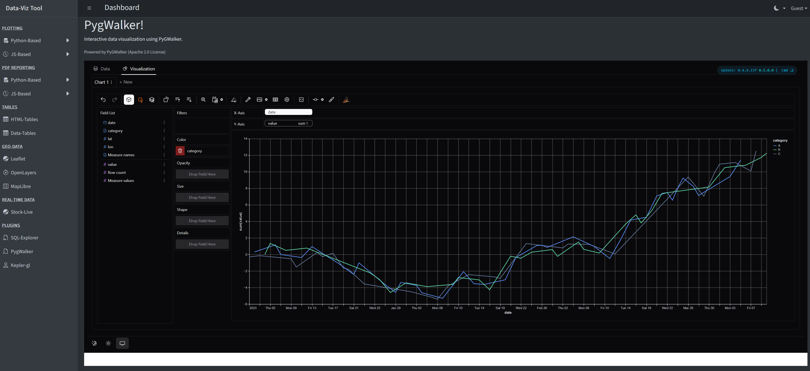
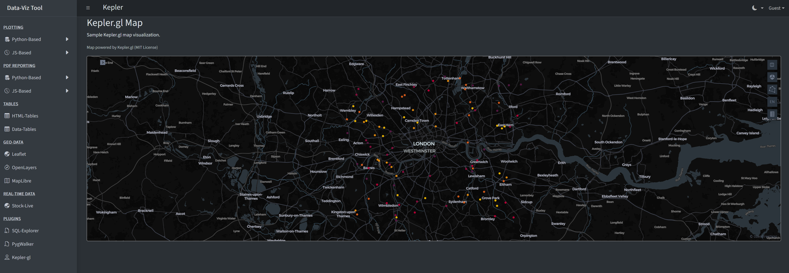

# Demo Portal - Data Visualization Dashboard

A comprehensive Django-based dashboard showcasing various data visualization libraries and reporting tools. This project demonstrates full-stack development skills, integrating Python backend data processing with modern frontend visualization technologies.

## Screenshots


*Interactive Dashboard with PyGWalker*


*Geospatial Analysis with Kepler.gl*

*(Note: Add your actual screenshots to the `screenshots/` folder and update the filenames above)*

## Features

*   **Interactive Dashboards**:
    *   **Plotly**: Interactive charts and tables.
    *   **Bokeh**: Python-based interactive visualizations.
    *   **PyGWalker**: Tableau-like drag-and-drop data exploration.
    *   **Apache ECharts**: High-performance, modern JavaScript charts.
    *   **Chart.js**: Simple and flexible JavaScript charting.
    *   **D3.js**: Custom, low-level data visualizations.
    *   **Stock Live**: Real-time data simulation using Plotly.js.

*   **Geospatial Visualization**:
    *   **Kepler.gl**: High-performance geospatial analysis (using OpenStreetMap tiles).
    *   **Leaflet**: Mobile-friendly interactive maps.
    *   **OpenLayers**: Open-source vector map rendering.
    *   **MapLibre**: Open-source vector map rendering.

*   **Reporting & Export**:
    *   **PDF Generation**: Examples using WeasyPrint, Matplotlib, and jsPDF.
    *   **Data Tables**: Interactive tables with sorting and filtering.

*   **Backend**:
    *   Built with **Django**.
    *   Data processing with **Pandas** and **NumPy**.

## Tech Stack

*   **Backend**: Python, Django, Pandas, NumPy
*   **Frontend**: HTML5, CSS3 (Bootstrap 5, AdminLTE), JavaScript
*   **Visualization Libraries**: Plotly, Bokeh, PyGWalker, Kepler.gl, OpenLayers, ECharts, Chart.js, D3.js, Leaflet, MapLibre GL JS

## Prerequisites

*   **Python**: Tested up to Python 3.12. (Note: Python 3.13 is currently not supported due to dependency compatibility issues).

## Installation

1.  **Clone the repository**:
    ```bash
    git clone https://github.com/kmaddala85/demo_portal.git
    cd demo_portal
    ```

2.  **Create and activate a virtual environment** (optional but recommended):
    ```bash
    python -m venv venv
    # Windows
    venv\Scripts\activate
    # macOS/Linux
    source venv/bin/activate
    ```

3.  **Install dependencies**:
    ```bash
    pip install -r requirements.txt
    ```

4.  **Set up environment variables**:
    *   Create a `.env` file in the root directory.
    *   Add your secret key and debug setting:
        ```env
        SECRET_KEY=your-secret-key-here
        DEBUG=True
        ```

5.  **Run migrations**:
    ```bash
    python manage.py migrate
    ```

6.  **Run the development server**:
    ```bash
    python manage.py runserver
    ```

7.  **Access the portal**:
    Open your browser and go to `http://127.0.0.1:8000/`.

## License

This project is open source and available under the [MIT License](LICENSE).

## Acknowledgments

*   [AdminLTE](https://adminlte.io) for the dashboard template.
*   All the amazing open-source visualization libraries used in this project.
